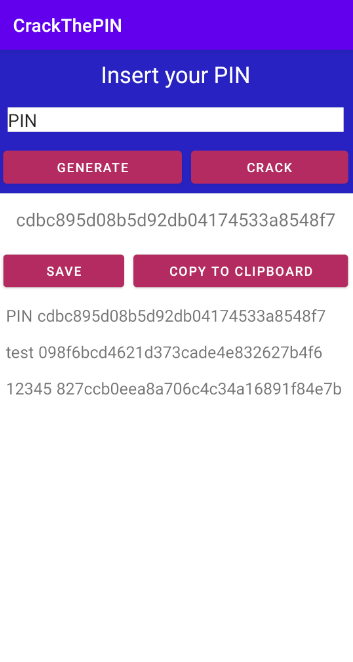

# Md5 hash PIN genertor/crack app

I created this app just to learn the ins and outs of mobile app development. Nothing crazy, just the basics.

## Applied functionality

- Generating hashed PIN with md5 hash function.
- Cracking hashed (md5) PIN .
- Copping generated/cracked PIN into the clipboard.
- JUnit tests.
- Saving items (input + output) into an SQLite database.
- Displaying given items from the database in RecyclerView.
- Deleting database items by swiping.

## More about the applied md5 hash class

I decided to use my own solution from Crack the PIN kata from [codewars](https://www.codewars.com). If you want to see more details about that challenge click [here](https://www.codewars.com/kata/5efae11e2d12df00331f91a6/java).